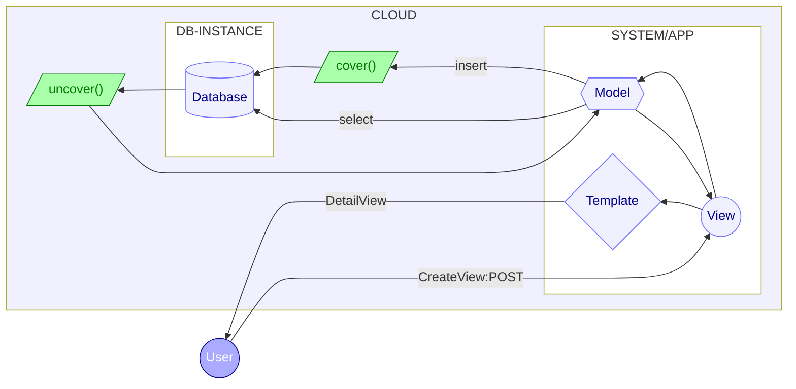

<h1 align='center'>:notebook: LIPSUM :notebook:</h1>

<h4 align='justify'>Made with Django as MVC framework, this project works as a real, useful online password manager. It uses cryptography to store the secrets in DB, so a DB leak of information will presents only encrypted data instead of raw sensitive information.</h4>

 

 

<h2 align='center'>:chart_with_upwards_trend: Project's Status :chart_with_upwards_trend:</h2>

:link: Check here: <https://lipsum.herokuapp.com> :link:

 

<h2 align='center'>:floppy_disk: Applied Technologies :cloud:</h2>

 

<h2 align='center'>:star: Features :star:</h2>

- [x] Save different services, even more than one save per services (e.g. two Instagram's accounts)
- [x] Save login's info for each saved service, such as email, username and password
- [x] Edit saved secrets once they get altered on the respective service
- [ ] Export your secrets to your email (the same used for login in this app)
- [ ] Generate locally pseudo-random passwords as platform suggestion

<h5 align='center'>Lipsum's current architecture</h5>

 

<h2 align='center'>:compass: Using :crystal_ball:</h2>

### Creating an Account

To start, if do not having an account, create one by going ate `/conta/registrar`, fill and submit the presented form. Then, insert your `username` and `password` you filled the creation form. Already have an account? Log in directly at `/conta/entrar` or clicking "Entrar" button.

### Undestanding the Interface

After log in, at every moment, there wil be a navbar at the top of the page. You can use it to navegate through the system and get some actions like:

* Create and overview your credentials
* Create and overview your cards
* Create and overview your notes
* Log out of your account

#### Index Page

This page shows the total of each secret (credentials, cards, notes) and a little history of your last secrets registration. Also gives you access to create and overview more secret.

#### Creation Page

Using navbar (clicking in a dropdown menu) or clicking an "Adicionar" button on index page, you access a creation page. As the page's form get filled, the `slug` (readonly) field gets that secret's reference; You can use it later to access that secret from url (e.g. `/segredo/cartao/:slug:`).

Properly filling the page's form and submitting it, you create a new secret with the information filled in that creation form and get redirected to a page that shows all of your registered secrets of that type (credential - credencial; card - cartao/cartão; note - anotação).

#### List Page

This page shows all secret you registered, one type at once. You can access it after create a new secret or using navbar. By clicking a secret displayed here, the new page rendered is a detailed view of that secret. If there is no secret of a type registered, the page shows a text message. The green button gets you to the creation page.

#### Detail page

Here you get a detailed view of the choosen secret, showing every information of that one. Besides that, there are 3 buttons at the top: the blue one (for editting the current secret), the red (delete the current secret) and the gray one (for adding a new secret).

 

<h2 align='center'>:warning: WARNINGS :warning:</h2>

* This project is already online, but also under development. Use it knowing that some bugs might happen, so keep, at least for now, your secrets that you have another way to access besides Lipsum.
* Due to it's gratuity, Lipsum supports a limited number of users, requests/online time and secrets stored on it's database. At some point this system will no longer offers registration for new users, preventing the database to colapse.
